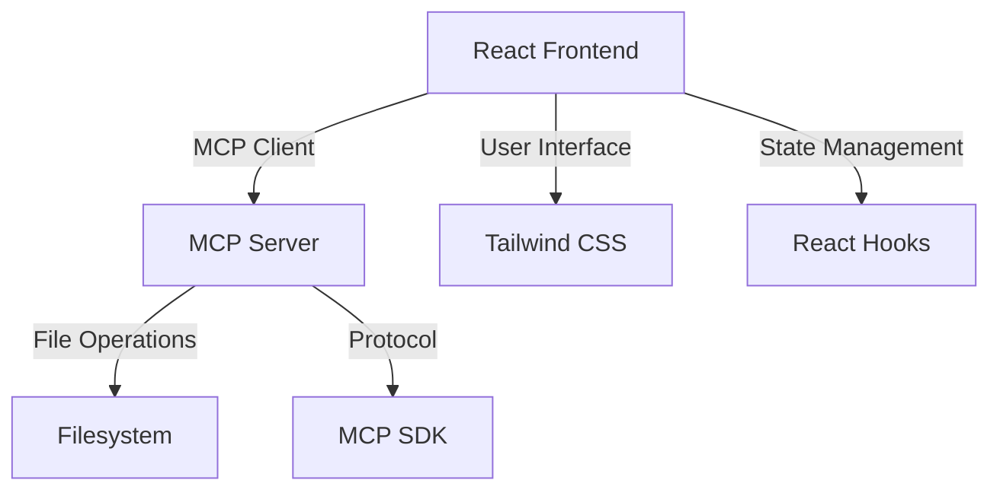

# 🚀 MCP Filesystem Manager

A modern, file management application built with **Model Context Protocol (MCP)**, React, and Tailwind CSS. Upload folders, edit files with natural language prompts, and manage your filesystem through an intuitive web interface.


## ✨ Overall Features

### 🎯 Core Functionality
- **📁 Folder Upload**: Drag & drop or browse to upload entire folder structures
- **📝 File Management**: Create, read, edit, and delete files seamlessly
- **🔄 Real-time Updates**: Live file content viewing and editing
- **🗂️ File Browser**: Intuitive file explorer with type indicators

### ⚙️ Server Features:

- MCP-compliant server with stdio transport
- Tools: create_file, read_file, edit_file, delete_file,list_files
- Error handling and process management

### 🎨 Modern UI/UX
- **📱 Responsive Design**: Works perfectly on desktop, tablet, and mobile
- **🎭 Smooth Animations**: Engaging micro-interactions and loading states

### 🔧 Technical Features
- **⚡ MCP Protocol**: Standards-compliant Model Context Protocol implementation
- **🔌 Real-time Communication**: Efficient client-server communication
- **🛡️ Error Handling**: Comprehensive error management and user feedback
- **🚀 Performance Optimized**: Fast file operations and smooth UI interactions

## 🏗️ Architecture



## 📋 Prerequisites

Before you begin, ensure you have the following installed:

- **Node.js**: Version 18.0 or higher
- **npm**: Version 8.0 or higher (comes with Node.js)
- **Git**: For cloning the repository

Check your versions:
```bash
node --version  # Should be 18.0+
npm --version   # Should be 8.0+
```

## 🚀 Quick Start

### 1️⃣ Clone the Repository
```bash
git clone https://github.com/yourusername/mcp-filesystem-manager.git
cd mcp-filesystem-manager
```

### 2️⃣ Backend Setup (MCP Server)

```bash
# Create and navigate to backend directory
mkdir mcp-filesystem-backend
cd mcp-filesystem-backend

# Initialize Node.js project
npm init -y

# Install MCP dependencies
npm install @modelcontextprotocol/sdk fs-extra path

# Create server.js file (copy from artifacts above)
touch server.js
```

**Edit `package.json`** to add ES modules support:
```json
{
    "name": "mcp-filesystem-server",
    "version": "1.0.0",
    "type": "module",
    "scripts": {
        "start": "node server.js",
        "dev": "nodemon server.js"
    }
}
```

### 3️⃣ Frontend Setup (React App)

```bash 
# Create React app with Vite
npm create vite@latest mcp-filesystem-frontend -- --template react
cd mcp-filesystem-frontend

# Install dependencies
npm install
npm install @modelcontextprotocol/client tailwindcss
```

### 4️⃣ Run the Application

```bash
# Start the MCP server (in mcp-filesystem-backend directory)
npm run dev

# Start the React frontend (in mcp-filesystem-frontend directory)
npm run dev
```

Visit `http://localhost:5173` to see the application running.
